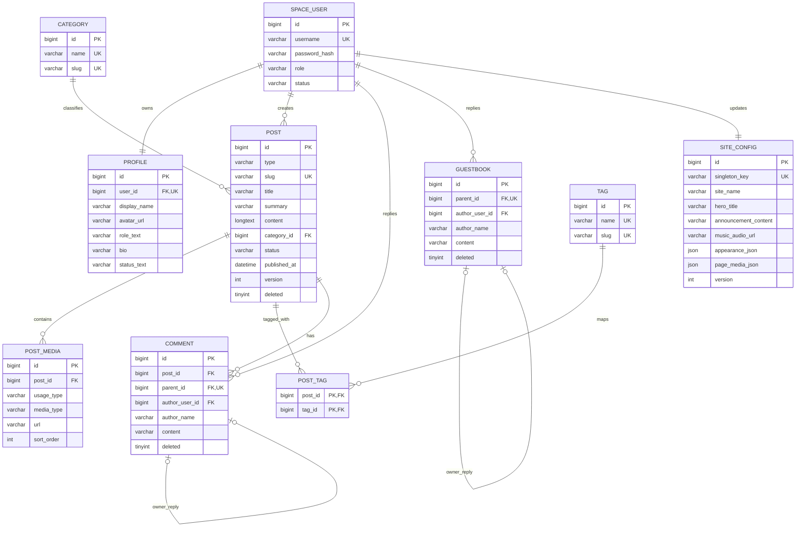

# BinSpace 数据库设计

> 版本：V1 Design Draft  
> 数据库：MySQL 8.x  
> 后端技术预期：Java、Spring Boot、MyBatis / MyBatis-Plus  
> 本文仅为设计，不包含可直接执行的建库 SQL。

## 1. 设计范围

V1 只考虑两种访问身份：

- `VISITOR`：匿名访问，不创建用户记录，只能读取已发布内容和公开空间配置。
- `OWNER`：登录用户，可以管理内容、评论、留言及空间配置。

V1 认证正式采用 **Spring Security + 服务端 Session + HttpOnly Cookie**。暂不使用 JWT，也不在业务数据库中增加 access token / refresh token 表。第一版按单实例服务端 Session 设计；未来多实例部署时再评估 Spring Session 和共享会话存储。

本设计覆盖：User、Post（TECH / MOMENT）、Category、Tag、PostTag、PostMedia、Comment、Guestbook、Profile、SiteConfig，以及 Hero、Announcement、Music 三个配置模块。

不在 V1 范围内：多空间、多 OWNER 协作、访客账号、点赞明细、关注关系、私信、OSS 文件表、搜索索引、审计日志和刷新令牌表。

## 2. 关键建模决策

### 2.1 TECH 与 MOMENT 共用 `post`

二者都是空间中按时间发布、可评论、可归档的内容，公共字段和生命周期一致，因此使用单表：

- `TECH` 使用 `slug`、`title`、`summary`、`category_id`、`reading_time_minutes`。
- `MOMENT` 不要求标题，上述 TECH 专属字段必须为空。
- 两种内容都使用 `content`、`post_media`、`created_at`、互动计数。

这样可直接支持首页 ALL 混排和统一归档，不需要跨表 `UNION`。

### 2.2 Category 与 Tag

- TECH 每篇最多属于一个 Category，因此 `post.category_id` 直接外键关联。
- Tag 与 Post 是多对多关系，使用 `post_tag`。
- MOMENT V1 不使用 Category；Tag 默认也只用于 TECH，但结构允许未来扩展。
- Category/Tag 逻辑删除后从公开可选列表和 Owner 新建表单候选项中隐藏，但既有 `post.category_id` 与 `post_tag` 关联必须保留。读取历史已发布文章时，详情查询需要包含已逻辑删除的关联项并返回其原名称，不能因为分类或标签停用而丢失文章元信息。

### 2.3 Hero、Announcement、Music 合并进 `site_config`

V1 只有一个 BinSpace，Hero、公告、音乐都只有一个当前生效版本，生命周期和权限完全一致。为三个单例各建一张只有一行的表会增加无意义的 Mapper、事务与关联查询，因此合并到一张 `site_config`：

- 使用明确列保存 Owner 当前可编辑字段，不把核心字段全部塞进 JSON。
- API 层仍输出独立的 `HeroVO`、`AnnouncementVO`、`MusicVO`。
- `appearance_json`、`page_media_json`、`external_links_json` 保存结构变化较快、目前主要用于展示的配置。
- 如果未来出现公告历史、播放列表或多个 Hero 方案，再把对应模块独立成表。

因此，Hero、Announcement、Music 在 V1 是明确的业务模型和 API 模块，但不是三张独立物理表。

`site_config.version` 是 Basic、Hero、Announcement、Music、Appearance、PageMedia 和 ExternalLinks **共享的单一乐观锁版本**，不是每个配置模块各自拥有版本。任意配置更新成功都会使该版本递增；前端必须用更新接口返回的最新版本覆盖本地版本，再执行下一次配置修改。

### 2.4 Profile 独立于 SiteConfig

Profile 与 OWNER 用户一对一关联，且会被动态作者区、关于页、评论回复等频繁引用，因此保留独立表，不并入站点配置。

### 2.5 Comment 与 Guestbook 不合表

- Comment 必须属于具体 Post。
- Guestbook 属于整个空间，不依赖 Post。

两者业务语义、查询入口、计数和删除策略不同，使用两张表。两张表均用 `parent_id` 表示一层 OWNER 回复，V1 不开放无限嵌套。

## 3. 通用约定

### 3.1 命名与类型

- 表名、列名使用 `snake_case`。
- 主键统一为 `BIGINT`，建议由 MyBatis-Plus `ASSIGN_ID` 或服务端雪花算法生成。
- 时间使用 `DATETIME(3)`，应用与数据库统一按 UTC 写入，响应时输出 ISO-8601。
- 文本统一 `utf8mb4`；排序规则建议 `utf8mb4_0900_ai_ci`。
- URL 使用 `VARCHAR(1024)`，正文使用 `LONGTEXT`。
- 金额不存在；计数使用 `INT UNSIGNED`。
- 状态值使用字符串代码而不是 MySQL `ENUM`，便于后续扩展和 Java 枚举映射。

### 3.2 通用审计列

业务表按需要使用：

| 字段 | 类型 | 说明 |
|---|---|---|
| `created_at` | DATETIME(3) | 创建时间 |
| `updated_at` | DATETIME(3) | 最后修改时间 |
| `created_by` | BIGINT NULL | 创建 OWNER；匿名历史数据可为空 |
| `updated_by` | BIGINT NULL | 最后修改 OWNER |
| `version` | INT UNSIGNED | 乐观锁版本，默认 0 |
| `deleted` | TINYINT(1) | 逻辑删除标记，0/1 |
| `deleted_at` | DATETIME(3) NULL | 删除时间 |
| `deleted_by` | BIGINT NULL | 执行删除的 OWNER |

## 4. 表结构

## 4.1 `space_user`

保存能够登录的 OWNER。匿名 VISITOR 不入表。使用 `space_user` 避免与通用保留词或框架概念 `user` 混淆。

| 字段 | 类型 | NULL | 默认值 | 约束 / 说明 |
|---|---|---:|---|---|
| `id` | BIGINT | 否 | — | PK |
| `username` | VARCHAR(64) | 否 | — | 登录名，唯一 |
| `password_hash` | VARCHAR(255) | 否 | — | 只保存强哈希，不保存明文 |
| `role` | VARCHAR(16) | 否 | `OWNER` | V1 只允许 OWNER |
| `status` | VARCHAR(16) | 否 | `ACTIVE` | `ACTIVE` / `DISABLED` / `LOCKED` |
| `last_login_at` | DATETIME(3) | 是 | NULL | 最后登录时间 |
| `created_at` | DATETIME(3) | 否 | 当前时间 | — |
| `updated_at` | DATETIME(3) | 否 | 当前时间 | — |
| `version` | INT UNSIGNED | 否 | 0 | 乐观锁 |
| `deleted` | TINYINT(1) | 否 | 0 | 逻辑删除 |
| `deleted_at` | DATETIME(3) | 是 | NULL | — |

约束：

- `UK_space_user_username (username)`。
- `CHECK role IN ('OWNER')`。
- `CHECK status IN ('ACTIVE','DISABLED','LOCKED')`。

## 4.2 `profile`

OWNER 对外展示的个人资料。

| 字段 | 类型 | NULL | 默认值 | 约束 / 说明 |
|---|---|---:|---|---|
| `id` | BIGINT | 否 | — | PK |
| `user_id` | BIGINT | 否 | — | FK → `space_user.id`，唯一 |
| `display_name` | VARCHAR(64) | 否 | — | 前端 `name` |
| `avatar_url` | VARCHAR(1024) | 是 | NULL | 前端 `avatar` |
| `role_text` | VARCHAR(128) | 是 | NULL | 展示文本，如 Java Backend Developer |
| `bio` | VARCHAR(500) | 是 | NULL | 一句话简介 |
| `status_label` | VARCHAR(64) | 是 | NULL | 如“空间状态” |
| `status_text` | VARCHAR(255) | 是 | NULL | 当前状态正文 |
| `status_emoji` | VARCHAR(32) | 是 | NULL | 可选 Emoji |
| `created_at` | DATETIME(3) | 否 | 当前时间 | — |
| `updated_at` | DATETIME(3) | 否 | 当前时间 | — |
| `version` | INT UNSIGNED | 否 | 0 | 乐观锁 |

约束与说明：

- `UK_profile_user_id (user_id)`，确保一名 OWNER 一个 Profile。
- 技术文章数、说说数、留言数不存入 Profile，通过聚合查询或缓存 VO 生成。
- V1 Profile 是必须存在的系统数据，不使用软删除；关闭用户时保留 Profile。

## 4.3 `category`

TECH 分类。

| 字段 | 类型 | NULL | 默认值 | 约束 / 说明 |
|---|---|---:|---|---|
| `id` | BIGINT | 否 | — | PK |
| `name` | VARCHAR(64) | 否 | — | 显示名 |
| `slug` | VARCHAR(80) | 否 | — | URL / 筛选标识 |
| `description` | VARCHAR(255) | 是 | NULL | 可选说明 |
| `sort_order` | INT | 否 | 0 | 排序 |
| `created_at` | DATETIME(3) | 否 | 当前时间 | — |
| `updated_at` | DATETIME(3) | 否 | 当前时间 | — |
| `version` | INT UNSIGNED | 否 | 0 | 乐观锁 |
| `deleted` | TINYINT(1) | 否 | 0 | 逻辑删除 |
| `deleted_at` | DATETIME(3) | 是 | NULL | — |

约束：

- `UK_category_name (name)`。
- `UK_category_slug (slug)`。
- 已被文章引用的分类不可直接物理删除；逻辑删除后不允许新文章选择。

## 4.4 `tag`

| 字段 | 类型 | NULL | 默认值 | 约束 / 说明 |
|---|---|---:|---|---|
| `id` | BIGINT | 否 | — | PK |
| `name` | VARCHAR(64) | 否 | — | 标签名 |
| `slug` | VARCHAR(80) | 否 | — | 稳定标识 |
| `created_at` | DATETIME(3) | 否 | 当前时间 | — |
| `updated_at` | DATETIME(3) | 否 | 当前时间 | — |
| `deleted` | TINYINT(1) | 否 | 0 | 逻辑删除 |
| `deleted_at` | DATETIME(3) | 是 | NULL | — |

约束：

- `UK_tag_name (name)`。
- `UK_tag_slug (slug)`。
- 标签匹配前应在服务层进行 trim 和大小写规范化。

## 4.5 `post`

TECH 与 MOMENT 的统一内容表。

| 字段 | 类型 | NULL | 默认值 | 约束 / 说明 |
|---|---|---:|---|---|
| `id` | BIGINT | 否 | — | PK |
| `type` | VARCHAR(16) | 否 | — | `TECH` / `MOMENT` |
| `slug` | VARCHAR(180) | 是 | NULL | TECH 稳定 URL；MOMENT 为空 |
| `title` | VARCHAR(180) | 是 | NULL | TECH 必填；MOMENT 为空 |
| `summary` | VARCHAR(600) | 是 | NULL | TECH 必填；MOMENT 为空 |
| `content` | LONGTEXT | 否 | — | TECH 正文或 MOMENT 正文 |
| `content_format` | VARCHAR(16) | 否 | `PLAIN_TEXT` | `MARKDOWN` / `PLAIN_TEXT` |
| `category_id` | BIGINT | 是 | NULL | FK → `category.id`；仅 TECH |
| `reading_time_minutes` | SMALLINT UNSIGNED | 是 | NULL | TECH；建议服务端计算 |
| `status` | VARCHAR(16) | 否 | `PUBLISHED` | `DRAFT` / `PUBLISHED` |
| `published_at` | DATETIME(3) | 是 | NULL | Visitor 排序和可见性依据 |
| `like_count` | INT UNSIGNED | 否 | 0 | V1 展示缓存，无点赞明细表 |
| `comment_count` | INT UNSIGNED | 否 | 0 | 非删除顶层评论数缓存 |
| `created_at` | DATETIME(3) | 否 | 当前时间 | — |
| `updated_at` | DATETIME(3) | 否 | 当前时间 | — |
| `created_by` | BIGINT | 否 | — | FK → `space_user.id` |
| `updated_by` | BIGINT | 否 | — | FK → `space_user.id` |
| `version` | INT UNSIGNED | 否 | 0 | 乐观锁 |
| `deleted` | TINYINT(1) | 否 | 0 | 逻辑删除 |
| `deleted_at` | DATETIME(3) | 是 | NULL | — |
| `deleted_by` | BIGINT | 是 | NULL | FK → `space_user.id` |

约束：

- `UK_post_slug (slug)`；MySQL 允许多个 NULL，因此 MOMENT 不冲突。
- slug 创建后保持稳定，修改标题默认不修改 slug。
- `CHECK type IN ('TECH','MOMENT')`。
- `CHECK status IN ('DRAFT','PUBLISHED')`。
- TECH：`slug`、`title`、`summary`、`category_id`、`reading_time_minutes` 必须非空。
- MOMENT：上述 TECH 专属字段必须为空，防止给说说伪造标题。
- Visitor 查询条件必须包含 `status='PUBLISHED' AND deleted=0 AND published_at<=NOW()`。

## 4.6 `post_tag`

| 字段 | 类型 | NULL | 默认值 | 约束 / 说明 |
|---|---|---:|---|---|
| `post_id` | BIGINT | 否 | — | FK → `post.id` |
| `tag_id` | BIGINT | 否 | — | FK → `tag.id` |
| `created_at` | DATETIME(3) | 否 | 当前时间 | — |

约束与策略：

- 复合主键 `PK (post_id, tag_id)`，天然防止重复标签。
- 解除标签时物理删除关联行；Post 或 Tag 逻辑删除时查询通过主表过滤。
- V1 服务层限制 TECH 最多 10 个标签。

## 4.7 `post_media`

保存 TECH Cover 和 MOMENT 图片。真实文件由未来 OSS 提供，本表只保存可访问地址和展示元数据。

V1 TECH 正文采用 Markdown，正文内图片 URL 直接保存在 `post.content` 的 Markdown 语法中，不为正文图片创建 `post_media` 记录。`post_media` 只负责：

- TECH：Cover。
- MOMENT：说说图片。

未来需要媒体复用、引用追踪或媒体库时，再增加独立 Media Asset 模型并迁移正文图片引用。

| 字段 | 类型 | NULL | 默认值 | 约束 / 说明 |
|---|---|---:|---|---|
| `id` | BIGINT | 否 | — | PK |
| `post_id` | BIGINT | 否 | — | FK → `post.id` |
| `usage_type` | VARCHAR(16) | 否 | `CONTENT` | `COVER` / `CONTENT` |
| `media_type` | VARCHAR(16) | 否 | `IMAGE` | `IMAGE` / `VIDEO` |
| `url` | VARCHAR(1024) | 否 | — | 媒体地址 |
| `poster_url` | VARCHAR(1024) | 是 | NULL | 视频封面 |
| `alt_text` | VARCHAR(255) | 是 | NULL | 无障碍描述 |
| `width` | INT UNSIGNED | 是 | NULL | 像素宽 |
| `height` | INT UNSIGNED | 是 | NULL | 像素高 |
| `sort_order` | SMALLINT UNSIGNED | 否 | 0 | 展示顺序 |
| `created_at` | DATETIME(3) | 否 | 当前时间 | — |
| `updated_at` | DATETIME(3) | 否 | 当前时间 | — |
| `deleted` | TINYINT(1) | 否 | 0 | 逻辑删除 |
| `deleted_at` | DATETIME(3) | 是 | NULL | — |

约束：

- `CHECK usage_type IN ('COVER','CONTENT')`。
- `CHECK media_type IN ('IMAGE','VIDEO')`。
- TECH V1 最多一个未删除 `COVER`，由服务层事务保证。
- TECH 的 `post_media` V1 只允许 `usage_type=COVER`；MOMENT 只允许 `usage_type=CONTENT`，由服务层按 Post 类型校验。
- `sort_order` 在同一 Post 内唯一不是强制要求；读取时按 `sort_order, id` 排序。

## 4.8 `comment`

针对具体 Post 的评论和 OWNER 回复。

| 字段 | 类型 | NULL | 默认值 | 约束 / 说明 |
|---|---|---:|---|---|
| `id` | BIGINT | 否 | — | PK |
| `post_id` | BIGINT | 否 | — | FK → `post.id` |
| `parent_id` | BIGINT | 是 | NULL | FK → `comment.id`；NULL 为顶层评论 |
| `author_user_id` | BIGINT | 是 | NULL | OWNER 回复关联 `space_user.id` |
| `author_name` | VARCHAR(64) | 否 | — | 匿名历史作者名或显示快照 |
| `author_avatar_url` | VARCHAR(1024) | 是 | NULL | 可选头像快照 |
| `content` | VARCHAR(2000) | 否 | — | 评论 / 回复正文 |
| `created_at` | DATETIME(3) | 否 | 当前时间 | — |
| `updated_at` | DATETIME(3) | 否 | 当前时间 | — |
| `deleted` | TINYINT(1) | 否 | 0 | 逻辑删除 |
| `deleted_at` | DATETIME(3) | 是 | NULL | — |
| `deleted_by` | BIGINT | 是 | NULL | FK → `space_user.id` |

约束与服务校验：

- `UK_comment_parent (parent_id)`：V1 每条顶层评论最多一个 OWNER 回复；多个 NULL 不冲突。
- 回复的 `post_id` 必须与父评论一致。
- 回复的父评论必须是顶层评论，禁止多级嵌套。
- 回复必须有 `author_user_id`，且用户角色为 OWNER。
- 顶层评论计入 `post.comment_count`；回复不计数。
- 若已删除回复后再次回复，更新并恢复原回复行，避免唯一约束冲突。

## 4.9 `guestbook`

空间留言和 OWNER 回复，不关联 Post。

| 字段 | 类型 | NULL | 默认值 | 约束 / 说明 |
|---|---|---:|---|---|
| `id` | BIGINT | 否 | — | PK |
| `parent_id` | BIGINT | 是 | NULL | FK → `guestbook.id`；NULL 为游客留言 |
| `author_user_id` | BIGINT | 是 | NULL | OWNER 回复时关联用户 |
| `author_name` | VARCHAR(64) | 否 | — | 游客昵称或 OWNER 显示名快照 |
| `author_avatar_url` | VARCHAR(1024) | 是 | NULL | 可选 |
| `content` | VARCHAR(2000) | 否 | — | 留言 / 回复正文 |
| `created_at` | DATETIME(3) | 否 | 当前时间 | — |
| `updated_at` | DATETIME(3) | 否 | 当前时间 | — |
| `deleted` | TINYINT(1) | 否 | 0 | 逻辑删除 |
| `deleted_at` | DATETIME(3) | 是 | NULL | — |
| `deleted_by` | BIGINT | 是 | NULL | FK → `space_user.id` |

约束与服务校验：

- `UK_guestbook_parent (parent_id)`：V1 每条留言最多一个 OWNER 回复。
- 回复只能指向顶层留言，禁止多级嵌套。
- Guestbook 的删除、回复和计数不能复用 Comment 业务逻辑。

## 4.10 `site_config`

全站唯一配置聚合。`singleton_key` 固定为 `PRIMARY`，应用启动时必须保证存在。

| 字段 | 类型 | NULL | 默认值 | 说明 |
|---|---|---:|---|---|
| `id` | BIGINT | 否 | — | PK |
| `singleton_key` | VARCHAR(32) | 否 | `PRIMARY` | 唯一单例键 |
| `site_name` | VARCHAR(64) | 否 | — | 英文名，如 BinSpace |
| `site_chinese_name` | VARCHAR(64) | 否 | — | 中文名 |
| `site_description` | VARCHAR(255) | 是 | NULL | 一句话说明 |
| `hero_eyebrow` | VARCHAR(128) | 是 | NULL | Hero eyebrow |
| `hero_title` | VARCHAR(180) | 否 | — | Hero 主标题 |
| `hero_subtitle` | VARCHAR(500) | 是 | NULL | Hero 副标题 |
| `hero_desktop_video_url` | VARCHAR(1024) | 是 | NULL | Desktop Video |
| `hero_mobile_video_url` | VARCHAR(1024) | 是 | NULL | Mobile Video |
| `hero_poster_url` | VARCHAR(1024) | 是 | NULL | Poster |
| `announcement_content` | VARCHAR(2000) | 是 | NULL | 空值表示不展示公告 |
| `announcement_enabled` | TINYINT(1) | 否 | 0 | 公告开关 |
| `music_title` | VARCHAR(180) | 是 | NULL | 曲目标题 |
| `music_artist` | VARCHAR(180) | 是 | NULL | 作者 |
| `music_audio_url` | VARCHAR(1024) | 是 | NULL | 音频地址 |
| `music_cover_url` | VARCHAR(1024) | 是 | NULL | 封面 |
| `appearance_json` | JSON | 是 | NULL | layoutMode、背景模式、透明度等 |
| `page_media_json` | JSON | 是 | NULL | moments/tech/guestbook/archive/about 背景配置 |
| `external_links_json` | JSON | 是 | NULL | homepage、github 等外链 |
| `created_at` | DATETIME(3) | 否 | 当前时间 | — |
| `updated_at` | DATETIME(3) | 否 | 当前时间 | — |
| `updated_by` | BIGINT | 是 | NULL | FK → `space_user.id`；NULL 表示数据库初始化产生的系统配置 |
| `version` | INT UNSIGNED | 否 | 0 | 所有配置更新共享乐观锁 |

约束与说明：

- `UK_site_config_singleton (singleton_key)`。
- `updated_by` 初始化时允许为 NULL；任一 Owner 配置更新成功后写入当前真实 OWNER ID。
- `version` 由 Basic、Hero、Announcement、Music、Appearance、PageMedia、ExternalLinks 共享。任一模块更新使用 `WHERE id=? AND version=?`，成功后统一递增，并把最新 version 返回前端。
- `announcement_enabled=1` 时正文必须非空；空正文保存时服务层自动设为 0。
- Music 缺少 `audio_url` 时 API 返回 `null`，前端显示等待后端开发。
- 核心配置不使用软删除；错误删除单例会导致站点不可启动，应由备份和权限控制保护。
- JSON 字段必须在服务层使用明确 DTO 校验，禁止无约束透传任意 JSON。

## 5. ER 图

## 6. 索引设计

除主键、唯一索引和外键索引外，建议建立：

| 表 | 索引 | 字段顺序 | 用途 |
|---|---|---|---|
| `post` | `IDX_post_public_feed` | `(deleted, status, published_at DESC, id DESC)` | 首页 ALL 与归档 |
| `post` | `IDX_post_type_feed` | `(type, deleted, status, published_at DESC, id DESC)` | TECH/MOMENT 列表 |
| `post` | `IDX_post_category_feed` | `(category_id, deleted, status, published_at DESC)` | TECH 分类筛选 |
| `post` | `IDX_post_created_by` | `(created_by, created_at DESC)` | Owner 内容查询 |
| `post_media` | `IDX_media_post_order` | `(post_id, deleted, sort_order, id)` | 媒体有序读取 |
| `post_tag` | `IDX_post_tag_tag_post` | `(tag_id, post_id)` | 按标签查文章 |
| `comment` | `IDX_comment_post_root` | `(post_id, deleted, parent_id, created_at, id)` | 评论与回复读取 |
| `comment` | `IDX_comment_parent` | `(parent_id)` | 回复关联 |
| `guestbook` | `IDX_guestbook_root` | `(deleted, parent_id, created_at DESC, id DESC)` | 留言板分页 |
| `guestbook` | `IDX_guestbook_parent` | `(parent_id)` | 回复关联 |
| `category` | `IDX_category_visible` | `(deleted, sort_order, id)` | 分类列表 |
| `tag` | `IDX_tag_visible` | `(deleted, name)` | 标签列表 |

说明：

- MySQL B-Tree 可反向扫描；DESC 列是否实际带来收益应根据执行计划验证。
- 不为低区分度的 `deleted` 单独建索引，而是放在业务组合索引中。
- `LIKE '%keyword%'` 不使用普通索引；全文搜索不在 V1 范围。

## 7. 唯一约束汇总

| 表 | 唯一约束 | 业务含义 |
|---|---|---|
| `space_user` | `username` | 登录名唯一 |
| `profile` | `user_id` | 一个用户一个 Profile |
| `category` | `name`、`slug` | 分类唯一 |
| `tag` | `name`、`slug` | 标签唯一 |
| `post` | `slug` | TECH URL 永久唯一；删除后默认不复用 |
| `post_tag` | `(post_id, tag_id)` | 防止重复关联 |
| `comment` | `parent_id` | 一条评论最多一个 Owner 回复 |
| `guestbook` | `parent_id` | 一条留言最多一个 Owner 回复 |
| `site_config` | `singleton_key` | 全站只有一份当前配置 |

## 8. 软删除策略

### 使用软删除

- `space_user`
- `category`
- `tag`
- `post`
- `post_media`
- `comment`
- `guestbook`

### 不使用软删除

- `profile`：依赖用户状态控制，不单独删除。
- `site_config`：系统单例不可删除。
- `post_tag`：纯关联数据，解绑时物理删除。

### 级联规则

- 删除 Post：事务内软删 Post 和 PostMedia；Comment 保留但对外不可查询，避免误级联丢失。恢复 Post 时评论仍可恢复展示。
- 删除顶层 Comment：软删该评论及其 OWNER 回复，并重新计算/递减 `comment_count`。
- 删除 Guestbook 顶层留言：软删留言及其 OWNER 回复。
- Category/Tag 逻辑删除不级联删除文章或关联行。公开分类/标签可选列表只查询 `deleted=0`；历史已发布文章详情必须通过专用关联查询读取原名称。Owner 编辑旧文章时可以看到已停用项，但保存时必须替换为有效项或由 Owner 先恢复该项。
- 物理清理由独立运维策略执行，不属于在线 API。

MyBatis-Plus 可将 `deleted` 配置为逻辑删除字段；所有自定义 SQL 仍必须显式检查逻辑删除条件。

## 9. 事务与并发边界

- 创建/编辑 TECH：Post、Category 校验、Tag upsert、PostTag 替换、PostMedia 替换在同一事务。
- 创建/编辑 MOMENT：Post 与 PostMedia 在同一事务。
- 删除 Post：Post 与媒体逻辑删除在同一事务。
- 回复 Comment/Guestbook：检查父记录、检查现有回复、写入或恢复回复在同一事务。
- 删除 Comment：软删评论链并更新 `post.comment_count` 在同一事务。
- 配置和 Profile 更新使用 `version` 乐观锁；版本不匹配返回冲突，不静默覆盖。Profile 使用自身版本，所有 SiteConfig 子模块共享 `site_config.version`。
- DTO 中的 `version` 是更新必填字段；Post 删除统一使用明确的 `version` Query 参数，不使用 `If-Match` / ETag 作为乐观锁协议。

## 10. 计数与派生数据

- `Profile.stats.techPostCount`：统计 `post.type='TECH'` 的已发布未删除记录。
- `Profile.stats.momentCount`：统计 `post.type='MOMENT'` 的已发布未删除记录。
- `Profile.stats.guestbookCount`：统计未删除顶层 Guestbook。
- `post.comment_count`：缓存未删除顶层评论数；写评论/删除评论时事务维护，定期校验。
- `post.like_count`：V1 只做展示字段，没有 Like 明细表和持久化点赞 API；后续要做真实点赞时必须新增明细或防重复机制。
- `reading_time_minutes`：TECH 保存时按后端统一规则计算，前端值不作为可信来源。

## 11. 初始化与数据完整性

系统首次部署至少需要：

1. 一条 ACTIVE OWNER `space_user`。
2. 对应的一条 `profile`。
3. 一条 `singleton_key='PRIMARY'` 的 `site_config`。
4. TECH 可选分类基础数据。

应用启动健康检查应验证 1–3；缺失时应报告配置错误，不应在普通 Visitor 请求中静默创建默认数据。
